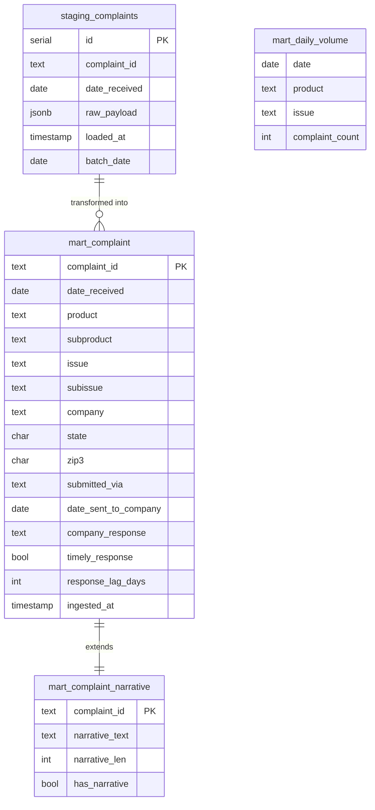

```mermaid
  erDiagram
      staging_complaints {
          serial id PK
          text complaint_id
          date date_received
          jsonb raw_payload
          timestamp loaded_at
          date batch_date
      }
      
      mart_complaint {
          text complaint_id PK
          date date_received
          text product
          text subproduct
          text issue
          text subissue
          text company
          char state
          char zip3
          text submitted_via
          date date_sent_to_company
          text company_response
          bool timely_response
          int response_lag_days
          timestamp ingested_at
      }
      
      mart_complaint_narrative {
          text complaint_id PK
          text narrative_text
          int narrative_len
          bool has_narrative
      }
      
      mart_daily_volume {
          date date
          text product
          text issue
          int complaint_count
      }
      
      staging_complaints ||--o{ mart_complaint : "transformed into"
      mart_complaint ||--|| mart_complaint_narrative : "extends"
```